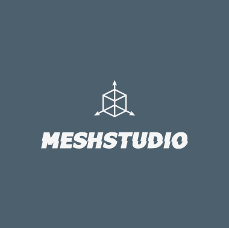

<p align="center">
  
  <br>
  
  <br>
  
  
  
  
  </a>
</p>


# MeshStudio-V2
MeshStudio Version 2, better optimisation, new tools and more !

<br>

### ** LAUNCH MESHSTUDIO ** 

**You need to install first => ```pip install https://github.com/Creator754915/Ursina.More.UI.git```**

**After run the Launcher.py**

## Keybinds:

  **shift + a**: Add an object

  **shift + r**: Rotate object
  
  **shift + t**: Modify the texture path
  
  **shift + s**: Save project
  
  **shift + o**: Open project

  **ctrl + right click**: Open Panel

  **left arrow / right arrow**: rotate object in the Y axis

  **up arrow / down arrow**: rotate object in the X axis

  **ctrl + scroll up**: + size to texture brush
  
  **ctrl + scroll down**: - size to texture brush

## Updates

## Examples

## The All Contributors Table

<table>
  <tbody>
    <tr>
      <td align="center" valign="top" width="14.28%"><a><br /><sub><b>IndividualCoder</b></sub></a><br /><a href="https://github.com/IndividualCoder" title="Developper">💻</a> <a href="#talk-kentcdodds" title="Talks">📢</a></td>
    </tr>
  </tbody>
</table>


*Version BETA-1.0.0*
